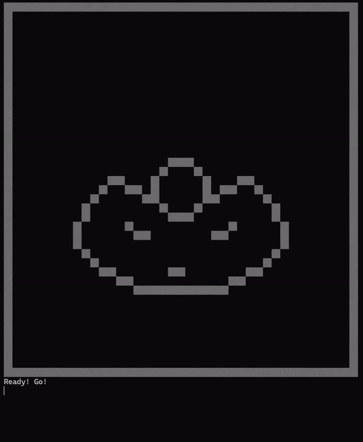
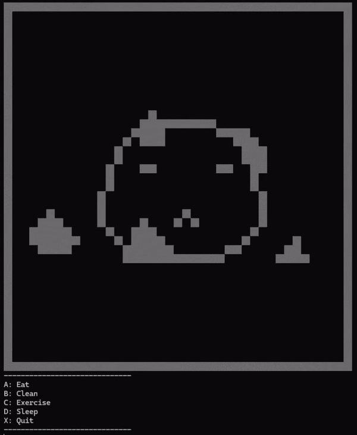

# Tamagotchi-cmd
A lightweight, Tamagotchi game played on the Windows command prompt, featuring custom graphics and animations. Built entirely in a no-internet environment without external Python libraries, this project demonstrates creativity in a constrained environments.

Originally created in 2020 by Team 1 as a short learning project, this game was rewritten in 2024 to adhere to PEP 8 standards.

## **Demos**

Below are demonstrations of the Tamagotchi game in action:

### **Exercise Animation**


### **Eating Animation**


### **Dirty Animation**


### **Cleaning Animation**


### **Asleep Screen**


### **Death Screen**


## Features
- **Dynamic Gameplay**: Manage your Tamagotchi's health, fitness, hunger, and happiness through various time-based interactions.
- **Custom Graphics and Animations**: Built entirely with ASCII art and Python's Standard Library, offering immersive visuals without external dependencies.
- **Save and Load Functionality**: Persist Tamagotchi states across sessions using JSON files stored locally.

## Requirements
The game was developed and tested on:
- **Windows 11**
- **Python 3.13**

## How to Play
1. Clone this repository to your local machine.
2. Navigate to the project folder in your terminal.
3. Run the game:
```
python main.py
```
